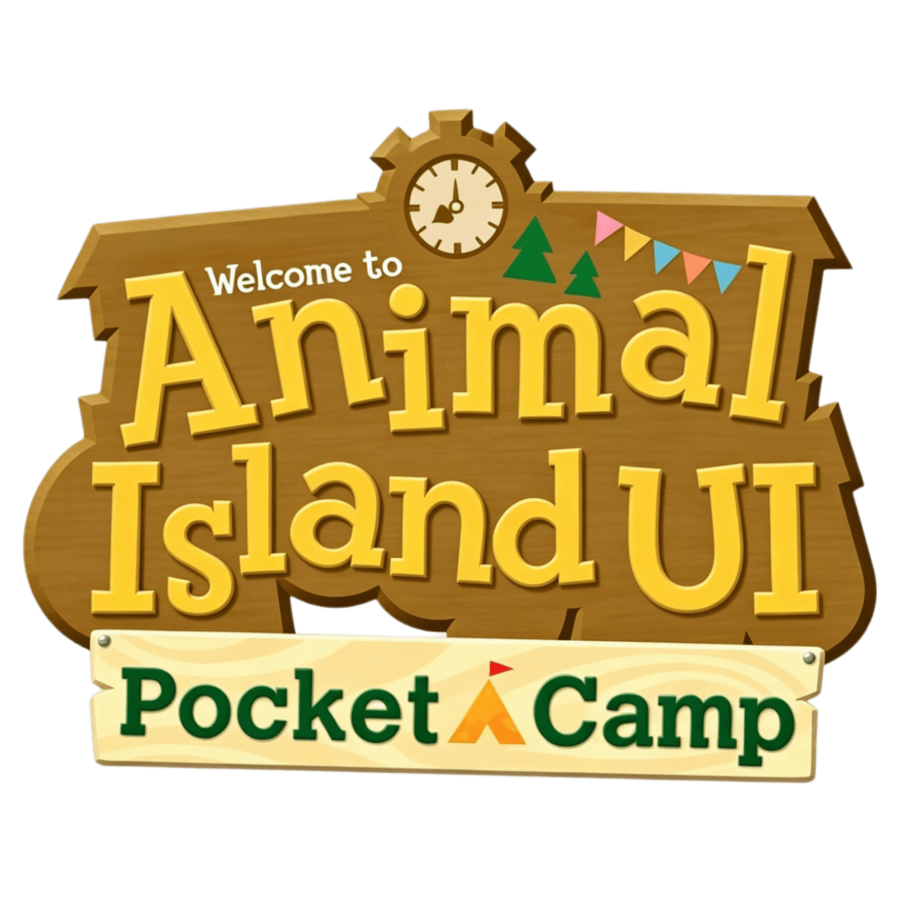
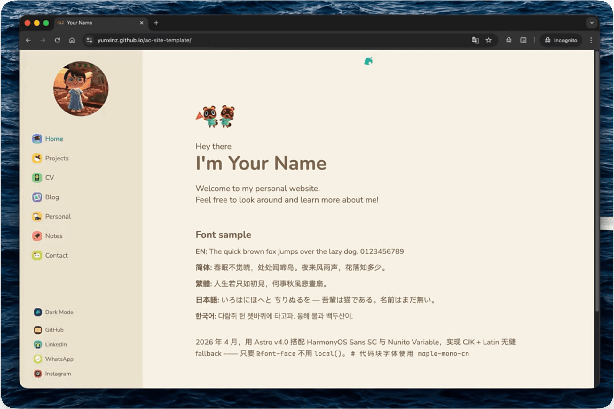
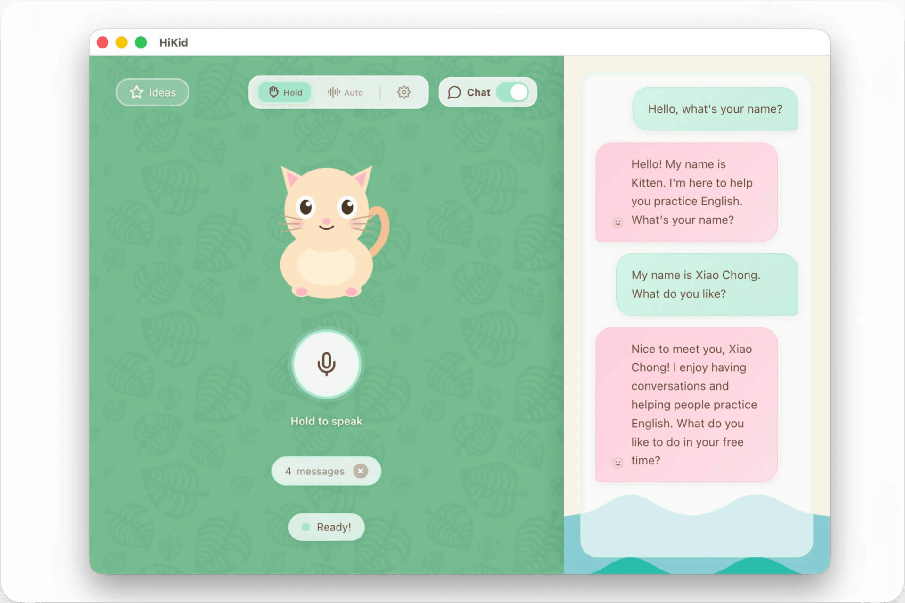
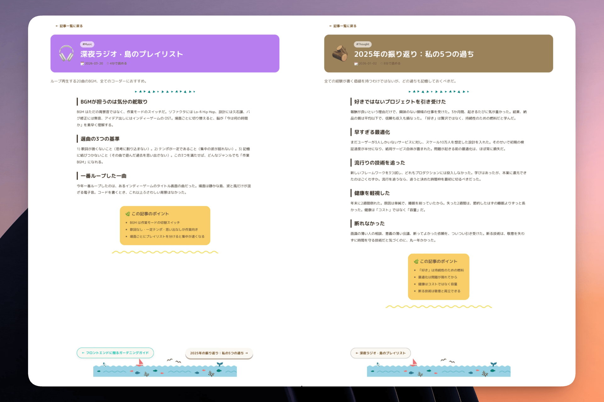

# 🏝 Animal-Island-Vue


<div align="center">
    
</div>
<div align="center">
    A Vue 3 UI component library inspired by Animal Crossing: New Horizons
</div>
<br/>
<div align="center">
    <a href="https://github.com/guokaigdg/animal-island-vue/stargazers"></a>
    <a href="LICENSE"></a>
    <a href="LICENSE"></a>
    <a href="https://github.com/guokaigdg/animal-island-vue/releases"></a>
</div>

<br/>
<p align="center">
    <a href="../README.md">中文</a> | English
</p>


## Introduction

This project is a lightweight UI component library built with Vue 3 + TypeScript + Less. It is the Vue port of [animal-island-ui](https://github.com/guokaigdg/animal-island-ui), with a design style inspired by Nintendo's "Animal Crossing: New Horizons" game interface, created for personal front-end technical practice and component development learning.

All visual elements, layouts, icons, and animations are independently designed and implemented, without directly using any official Nintendo art materials, code, or resource files.


## Preview

- Online Preview (PC) [animal-island-vue-pc](https://guokaigdg.github.io/animal-island-vue/#/)
- Online Preview (Mobile) [animal-island-vue-mobile](https://guokaigdg.github.io/animal-island-vue/#/)

## Installation

```bash
npm install animal-island-vue
```


## Quick Start

> ⚠️ **Important**: Please make sure to import the styles with `import 'animal-island-vue/style'`, otherwise the components will have no styles or fonts!

```vue
<script setup lang="ts">
import { Button, Card } from 'animal-island-vue';
import 'animal-island-vue/style';
</script>

<template>
    <div>
        <Button type="primary">Start Adventure</Button>
        <Card color="app-blue">
            Welcome to the deserted island!
        </Card>
    </div>
</template>
```

## Documentation

Complete reference for different scenarios:

| Document | Purpose |
|---|---|
| [`AI_USAGE.md`](../AI_USAGE.md) | AI code assistant handbook - all component props, types and defaults word-for-word, hard rules and copy-paste boilerplate, no invented APIs. |
| [`DESIGN_PROMPT.md`](../DESIGN_PROMPT.md) | One-click reproduction prompts for v0 / Figma AI / Midjourney / DALL-E, including color palette, fonts, size tables, Modal clip-path and prohibition list. |
| [`skill/SKILL.md`](../skill/SKILL.md) | Pixel-perfect style specification Skill - design tokens, all component CSS, Demo layout values, Less variable templates and new component development checklist. |
| [`CONTRIBUTING.md`](../CONTRIBUTING.md) | Contributing Guide |


## Local Development

```bash
# Clone the repository
git clone https://github.com/guokaigdg/animal-island-vue.git
cd animal-island-vue

# Install dependencies
npm install

# Start Demo development server
npm run dev

# Build component library
npm run build

# Build Demo site
npm run build:docs
```


## Usage Cases

|<a href="https://github.com/yunxinz/ac-site-template">ac-site-template</a> (Animal Crossing themed personal website template)  |  <a href="https://github.com/xiaochong/hi-kid">HiKid</a> (English learning app for children) |
| --- | --- |
|   | |
|<a href="https://github.com/guokaigdg/animal-island-blog">animal-island-blog</a>（animal-island blog）  |   |
|   | |


## Notes

- This project is for personal learning, research, and non-commercial demonstration only. Any form of commercial use, resale, or profit-making activities is prohibited.
- Not for use in any commercial products, enterprise projects, external services, or paid templates.
- Users are solely responsible for any risks arising from the use of this component library.

## Copyright and Disclaimer

- This project is not an official Nintendo product and has no association, authorization, or cooperation with Nintendo Co., Ltd.
- The game name included in the project name is only a descriptive reference to the style and does not constitute trademark use or brand association.
- All interface styles are merely design inspiration references and do not constitute reproduction or infringement of the original work.
- If the copyright holder believes that related content is suspected of infringement, they can contact via email, and I will make rectifications or deletions immediately.

## Contact

For any questions or copyright-related communications, please contact via Issue or email.

## License

MIT
For learning purposes only.
This project is released under the MIT open-source license, for learning use only. The author is not responsible for any legal issues or losses caused by the use of this library.
